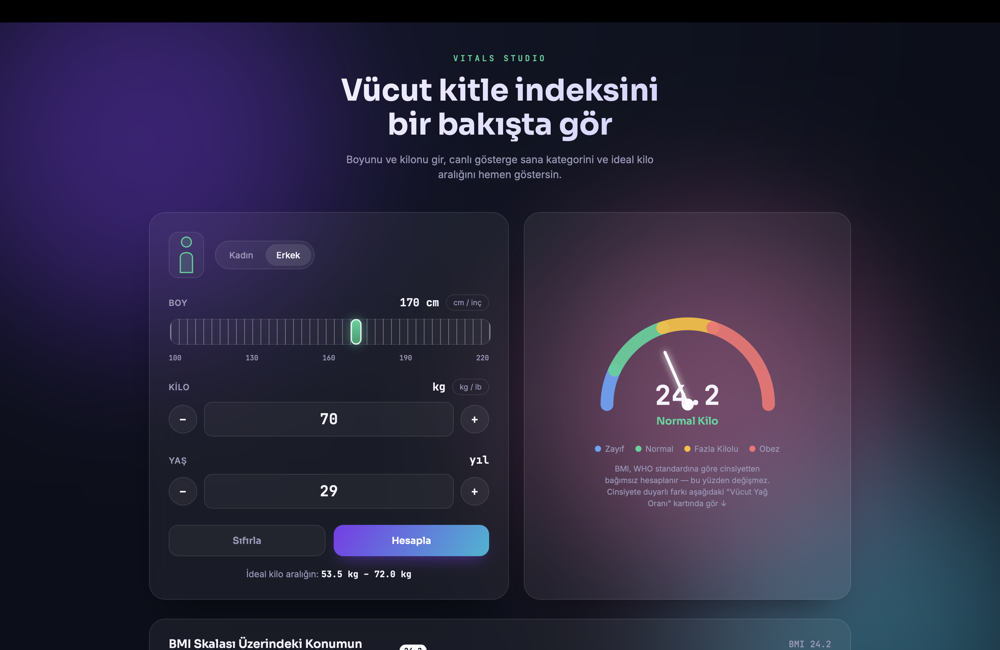
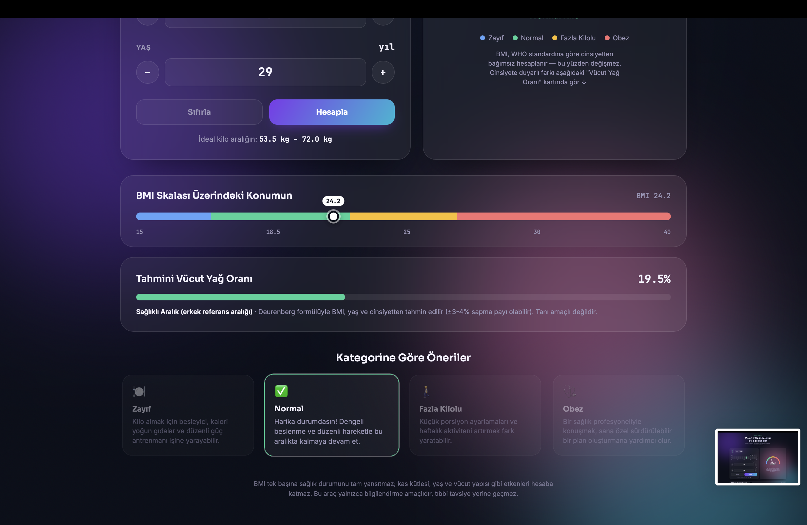

# 🩺 BMI (Vücut Kitle İndeksi) Hesaplayıcı — Vitals Studio

<div align="center">

  
  
  [](https://developer.mozilla.org/en-US/docs/Web/HTML)
  [](https://developer.mozilla.org/en-US/docs/Web/CSS)
  [](https://developer.mozilla.org/en-US/docs/Web/JavaScript)

  <p align="center">
    Aurora arka plan animasyonları, cam efekti (Glassmorphism) ve dinamik göstergeler ile tasarlanmış; BMI hesaplama, ideal kilo analizi ve cinsiyete duyarlı vücut yağ oranı tahmini sunan modern sağlık arayüzü.
  </p>

</div>

---





---

## 🌟 Öne Çıkan Özellikler

- **⏱️ Canlı BMI Göstergesi (Gauge):** SVG tabanlı ibre animasyonu ve WHO standartlarına uygun renkli bölge (Zone) takibi.
- **📏 Çoklu Birim Desteği:** Boy için `cm / inç`, kilo için `kg / lb` birimleri arasında anlık dönüşüm.
- **🧬 Tahmini Vücut Yağ Oranı:** *Deurenberg* formülü kullanılarak yaş, BMI ve cinsiyet parametreleriyle dinamik yağ oranı hesaplama.
- **🎯 İdeal Kilo Aralığı:** Girilen boy değerine göre sağlıklı kilo sınırlarını otomatik görüntüleme.
- **💡 Dinamik Öneri Kartları:** Hesaplanan BMI kategorisine göre otomatik aktifleşen kişiselleştirilmiş tavsiyeler.
- **🌌 Aurora Glassmorphism Tasarım:** Akıcı arka plan animasyonu ve karanlık tema (Dark Mode) uyumu.

---

## 🛠️ Kurulum ve Çalıştırma

Projeyi yerel makinenizde çalıştırmak için depoyu klonlayıp `index.html` dosyasını tarayıcınızda açmanız yeterlidir:

```bash
git clone [https://github.com/westblood585-sketch/bmi-vucut-kitle-indeksi-hesaplayici.git](https://github.com/westblood585-sketch/bmi-vucut-kitle-indeksi-hesaplayici.git)
cd bmi-vucut-kitle-indeksi-hesaplayici